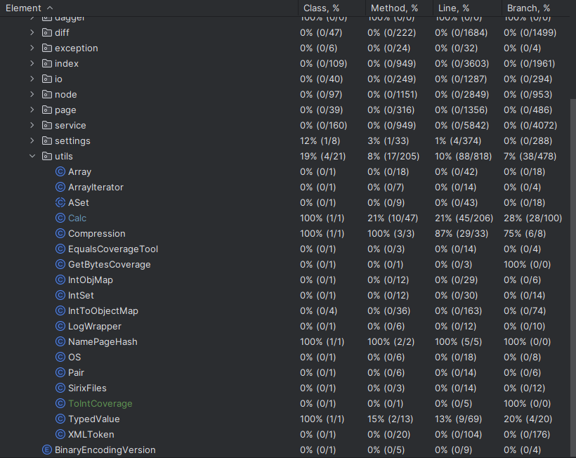

# Report for Assignment 1

## Project chosen

Name: Sirix

URL: https://github.com/sirixdb/sirix/tree/main

Number of lines of code and the tool used to count it:  
Total Lines: 190459  
Source Code Lines: 107800  
Disclaimer: Lines should be a bit less than this, since they were counted after we already improved 2 functions,  
but it shouldn't matter since the requirement is well over 10k in either case.  
Tool used: Statistics plugin in IntelliJ  

Programming language: Java  

## Coverage measurement

### Existing tool

There isn't a clear name of the existing tool, it's built into the IntelliJ text editor.
You can either run tests normally, debug them, or run them with coverage, which is what we did.

Existing Tool Coverage Image:  

### Your own coverage tool

**_Group member 1:_** Sven  
**Function 1**: getBytes

Commits:  
https://github.com/sirixdb/sirix/commit/6e3f7603fe00d56dc8400d887cb0349e4c9619a2  
https://github.com/sirixdb/sirix/commit/49243c156d3480a46da1a6abc4e5cb0a349df6a1  
I did all of the cover measurements and the tests in the same commit and for some reason they got split into two commits,
so both of the commits above contain the entirety of the changed function, plus tests.

Screenshot of coverage result by output:  

**Function 2**: ToInt  

Commits:  
https://github.com/sirixdb/sirix/commit/e48b78d9065111d31efaac3b6220715ab03b9ecf

Screenshot of coverage result by output:  

**_Group member 2:_** Duarte  
**Function 1**: FromUintVar in io/sirix/utils/Calc.java

Commits:  
https://github.com/sirixdb/sirix/commit/9ddac81194e55e87767dd93e3928dd9377790038  
https://github.com/sirixdb/sirix/commit/3cf1127d8070d23c8d8dc2000f9867f08d60229f  
Initially used the coverage tool developed by Simao for the ToUintVar function, since it shared a lot of similarities.  
Ended up creating a copy of it and dedicating it entirely for the FromUintVar, ensuring that the calculated branch coverage was correct.  
These commits include both the tool and the tests used.

Screenshot of coverage result by output:  

**Function 2**: Equals in io/sirix/utils/Array.java  
Commits:  
https://github.com/sirixdb/sirix/commit/88801e85bf26fd12f51441f85efb2eff6aad24c0  
Screenshot of coverage result by output:  

**_Group member 3:_** João Simão , Student Nr 2756702  
**Function 1**: equals(...) in io/sirix/utils/TypedValue.java

The function has 4 if-else-branches + for loop.

Commits:  
https://github.com/Svhnn/sirixFork/commit/f2c89cbf5e0c3ba3a987f93e7ccc389675f05e73   

Screenshot of coverage result by output:  

**Function 2**: toUIntVar(byte[] b) in io/sirix/utils/Calc.java 

The function has 5 branches.

Commits:  
https://github.com/Svhnn/sirixFork/commit/c33bf964650d5bc57c0892bd5befbc8f36267a00

Screenshot of coverage result by output:  

## Coverage improvement

### Individual tests

**_Group member 1:_** Sven  
**Test 1**:

Commits:  
https://github.com/sirixdb/sirix/commit/6e3f7603fe00d56dc8400d887cb0349e4c9619a2  
https://github.com/sirixdb/sirix/commit/49243c156d3480a46da1a6abc4e5cb0a349df6a1  
These are the same commits as shared above, since I mentioned that I did both the tests and the measurements at once.

Old coverage report:  
  

New coverage report:  
  

Coverage improvement: 2, by 10%. The reason the coverage has been improved, is because tests have been made to check the
possible inputs for the function. Assertions have been made with a true and a false input, and they're being ran. This
makes the coverage go up because both branches are now being checked. We in total have 2 branches, the if - else which
means that if it's being checked properly, the coverage goes up by 2.

**Test 2**

Commits:  
https://github.com/sirixdb/sirix/commit/e48b78d9065111d31efaac3b6220715ab03b9ecf  

Old coverage report:  
  

New coverage report:  
  

Coverage improvement: 6, by 6%. The reason the coverage has been improved, is because now all the if statements are 
being checked. Assertions are being made to check the input that variates with each different length input for the 
function. The coverage going up by 6 makes sense, because there's 3 if statements, each accounting for 2 branches since
some of them don't necessarily have an else, except for the last statement. So twice the if statements which have an
invisible else so 2 x 2 plus the final if + else statements is 4 + 2 = 6.

**_Group member 2:_** Duarte  
**Test 1**:  

Commits:  
https://github.com/sirixdb/sirix/commit/9ddac81194e55e87767dd93e3928dd9377790038  
https://github.com/sirixdb/sirix/commit/3cf1127d8070d23c8d8dc2000f9867f08d60229f  
Same as before, due to the fact that both include the tool and test as mentioned before.  

Old coverage report:  
  

New coverage report:  
  

Coverage improvement: 8, by 8%. Tests have been devised to check all the different branches within the FromUintVar function.
The improvement by 8% makes sense due to the fact that there exist 100 different branches and my tests cover 8 of those,
hence the increase.

**Test 2**:  
Commits:  
https://github.com/sirixdb/sirix/commit/88801e85bf26fd12f51441f85efb2eff6aad24c0  

Old coverage report:  
  

New coverage report:  
  

Coverage improvement: 12, by 66%. Tests have been devised to check all the different branches within the Equals function in the io/sirix/utils/Array.java.
The improvement is so drastic due to the fact that there isn't to many branches hence the increase.

**_Group member 3:_** João Simão , Student Nr 2756702  
**Test 1**:

Commits:  
https://github.com/Svhnn/sirixFork/commit/f2c89cbf5e0c3ba3a987f93e7ccc389675f05e73  

Old coverage report:  
  

New coverage report:  
  

Coverage improvement: 5, by 25%. The reason the coverage has been improved, is because tests have been made to check the
possible inputs for the function. Assertions to test when one of the inputs is null, when they have unequal lenghts,
when the inputs are different and when they are equal. The function had 0% coverage and was improved to have 100% coverage.

**Test 2**

Commits:  
https://github.com/Svhnn/sirixFork/commit/c33bf964650d5bc57c0892bd5befbc8f36267a00  

Old coverage report:  
  

New coverage report:  
  

Coverage improvement: 8, by 8%. The reason the coverage has been improved, is because tests have been made to check the
possible inputs for the function. Assertions to test if input is null, if length is on, if length is two, if length is 3
and if it is greater than 3. The function had 0% coverage and was improved to have 100% coverage.

### Overall

Old coverage report:  
  

New coverage report:  
  

## Statement of individual contributions

What each group member did.  
Group member 1, Sven:  
Looked for a project, tried different python projects that didn't work due to library issues. Settled on finding a java
project, this one. Figured out the general coverage report and checked the number of lines. Updated the forms with
our group name and nloc. Updated the getBytes function by using a separate GetBytesCoverage file in which there's a
hashmap that contains booleans to check each branch hit. Then made a BranchCoverageGetBytesTest file inside the test
folder to be able to print out the measurements and be able to update the coverage. This has two assertions which
are checking whether the true and false inputs are being covered correctly inside of the getBytes function. Then 
calculates the total amount of branch coverage by taking the number of hits and inputs. Did essentially the same for
the toInt function, the only difference here is that there's 4 different branches, 3 ifs and one else, made the same
type of files for toInt as for getByte but with different names. Checked the length and output correspondence with
4 assertions with different inputs. Also did all the general README information.  

Group member 2, Duarte:  
Sifted through 15+ projects in python in hopes of finding one both easy to understand and implement our tests.
After spotting a mistake with Simao, from our colleague we were forced to change the project since the initial reading of 
NLOC was wrong, due to it also reading environment parameters. From there I dedicated my time to understand how and why 
it was relevant to increase the coverage of the branches. Once that was done  I chose two  functions, the equals in Array 
and FromUintVar in Calc. Created individual tools for both of the functions, to measure the coverage along with creating 
tests for each of these. The coverage tool I used was based upon Simao's tool, hence the similarities.

Group member 3, Simão  
Looked for different python projects with my teammates. Organised calls and meetings in uni so that we could work 
together as a group. I worked on two different functions as stated above and improved the README file.
Created individual tools for each function. Measured the coverage with the printing and the built-in coverage tool.
I also tried to keep all members at the same understanding level, since we found the assignment to be confusing at first.

